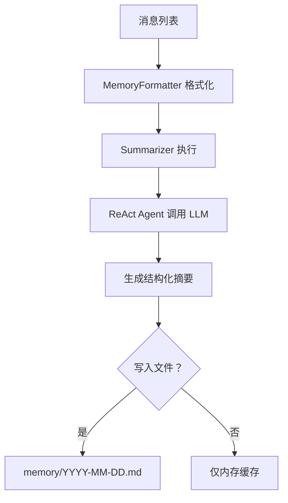

# CoPaw 记忆版本管理与摘要归纳机制分析

## 📋 目录

- [当前实现架构](#当前实现架构)
- [记忆版本管理机制](#记忆版本管理机制)
- [记忆摘要归纳流程](#记忆摘要归纳流程)
- [存在的问题与优化建议](#存在的问题与优化建议)
- [实现方案](#实现方案)

---

## 当前实现架构

### 核心组件

```
┌─────────────────────────────────────────────────────────────┐
│                     CoPaw Agent                              │
├─────────────────────────────────────────────────────────────┤
│  MemoryManager (继承 ReMeCopaw)                              │
│  ├── MemoryCompactionHook (上下文监控)                       │
│  ├── Compactor (压缩器)                                      │
│  ├── Summarizer (摘要器)                                     │
│  └── MemorySearch (混合检索)                                 │
├─────────────────────────────────────────────────────────────┤
│  存储层                                                       │
│  ├── MEMORY.md (长期记忆)                                    │
│  ├── memory/YYYY-MM-DD.md (每日日志)                         │
│  └── tool_result/ (工具输出缓存)                             │
└─────────────────────────────────────────────────────────────┘
```

### 关键代码位置

| 组件 | 文件路径 | 功能 |
|-----|---------|------|
| MemoryManager | `src/copaw/agents/memory/memory_manager.py` | 记忆管理主入口 |
| MemoryCompactionHook | `src/copaw/agents/hooks/memory_compaction.py` | 自动压缩触发 |
| ReMeCopaw | `reme/reme_copaw.py` | 底层实现 (第三方库) |
| Summarizer | `reme/memory/file_based_copaw/summarizer.py` | 摘要生成 |
| Compactor | `reme/memory/file_based_copaw/compactor.py` | 对话压缩 |

---

## 记忆版本管理机制

### 当前实现

**现状：CoPaw 当前没有显式的记忆版本管理机制**

当前的记忆更新是**覆盖式**的：

```python
# src/copaw/agents/memory/agent_md_manager.py
def write_memory_md(self, md_name: str, content: str):
    """直接覆盖写入，无版本保留"""
    file_path = self.memory_dir / md_name
    file_path.write_text(content, encoding="utf-8")  # 直接覆盖
```

### 记忆状态标记

ReMe 使用 `_MemoryMark` 标记消息状态：

```python
from agentscope.agent._react_agent import _MemoryMark

_MemoryMark.COMPRESSED  # 已压缩
_MemoryMark.DEFAULT     # 原始消息
```

**限制**：
- 仅标记内存中的消息状态
- 不保留历史版本
- 无法回溯到之前的记忆状态

---

## 记忆摘要归纳流程

### 1. 触发条件

```python
# src/copaw/agents/hooks/memory_compaction.py
async def __call__(self, agent, kwargs):
    # 估算上下文 token 总数
    estimated_total_tokens = message_tokens + summary_tokens
    
    # 触发条件：超过阈值的 70%
    if estimated_total_tokens > self.memory_compact_threshold:
        # 1. 同步压缩
        compact_content = await self.memory_manager.compact_memory(...)
        
        # 2. 异步持久化摘要
        self.memory_manager.add_async_summary_task(messages=messages_to_compact)
```

### 2. 摘要生成流程



### 3. Summarizer Prompt 模板

```python
# reme/memory/file_based_copaw/summarizer.py
user_message = f"""
<conversation>
{history_formatted_str}
</conversation>

请总结以上对话，提取关键信息：
- 日期：{date}
- 工作目录：{working_dir}
- 记忆目录：{memory_dir}

要求：
1. 保留关键决策和上下文
2. 记录文件路径和错误信息
3. 结构化输出便于后续检索
"""
```

### 4. 异步摘要任务管理

```python
# reme/reme_copaw.py
def add_async_summary_task(self, messages: list[Msg]):
    """添加后台摘要任务"""
    # 1. 清理已完成的任务
    remaining_tasks = []
    for task in self.summary_tasks:
        if task.done():
            # 处理完成状态（成功/失败/取消）
            continue
        else:
            remaining_tasks.append(task)
    self.summary_tasks = remaining_tasks
    
    # 2. 创建新任务
    task = asyncio.create_task(self.summary_memory(messages))
    self.summary_tasks.append(task)
```

### 5. 摘要写入逻辑

**当前问题：摘要生成后，写入文件的逻辑由 LLM 决定**

```python
# Summarizer 使用 ReAct Agent，可以调用文件工具
agent = ReActAgent(
    name="reme_summarizer",
    model=self.chat_model,
    sys_prompt="You are a helpful assistant.",
    formatter=self.formatter,
    toolkit=self.toolkit,  # 包含 read/write/edit 工具
)
```

**LLM 自主决定**：
- 是否写入 `MEMORY.md`（长期记忆）
- 是否写入 `memory/YYYY-MM-DD.md`（每日日志）
- 是否仅返回摘要字符串

---

## 存在的问题与优化建议

### 问题 1: 无版本控制

**现状**：
- 记忆文件直接覆盖，无历史版本
- 无法回溯到之前的记忆状态
- 误操作或错误摘要无法恢复

**影响**：
- 重要信息可能丢失
- 无法审计记忆变更历史
- 调试困难

### 问题 2: 摘要质量依赖 LLM

**现状**：
- 摘要内容完全由 LLM 自主决定
- 无结构化约束
- 可能遗漏关键信息

**影响**：
- 摘要质量不稳定
- 重要决策可能被忽略
- 检索效果受影响

### 问题 3: 旧记忆未合并

**现状**：
- 每日日志独立，未定期合并
- `memory/` 目录随时间增长
- 无归档机制

**影响**：
- 磁盘占用持续增长
- 检索范围过大影响性能
- 长期记忆碎片化

### 问题 4: 无差异更新

**现状**：
- 每次摘要都是全量写入
- 不检测与旧记忆的差异
- 可能重复写入相同信息

**影响**：
- 存储冗余
- 检索结果重复

---

## 实现方案

### 方案 1: 记忆版本控制

```python
# src/copaw/agents/memory/version_manager.py
import shutil
from datetime import datetime
from pathlib import Path

class MemoryVersionManager:
    """记忆版本管理器"""
    
    def __init__(self, memory_dir: Path, max_versions: int = 5):
        self.memory_dir = memory_dir
        self.version_dir = memory_dir / ".versions"
        self.max_versions = max_versions
        self.version_dir.mkdir(parents=True, exist_ok=True)
    
    def save_version(self, filename: str, content: str) -> str:
        """保存记忆文件版本"""
        timestamp = datetime.now().strftime("%Y%m%d_%H%M%S")
        version_path = self.version_dir / f"{filename}.{timestamp}"
        version_path.write_text(content, encoding="utf-8")
        
        # 清理旧版本
        self._cleanup_old_versions(filename)
        
        return str(version_path)
    
    def _cleanup_old_versions(self, filename: str):
        """保留最近 N 个版本"""
        versions = sorted(
            self.version_dir.glob(f"{filename}.*"),
            key=lambda p: p.stat().st_mtime,
            reverse=True
        )
        for old_version in versions[self.max_versions:]:
            old_version.unlink()
    
    def list_versions(self, filename: str) -> list[dict]:
        """列出所有可用版本"""
        versions = sorted(
            self.version_dir.glob(f"{filename}.*"),
            key=lambda p: p.stat().st_mtime,
            reverse=True
        )
        return [
            {
                "path": str(v),
                "created_time": datetime.fromtimestamp(
                    v.stat().st_mtime
                ).isoformat(),
                "size": v.stat().st_size,
            }
            for v in versions
        ]
    
    def restore_version(self, version_path: str, filename: str):
        """恢复指定版本"""
        version_file = Path(version_path)
        if not version_file.exists():
            raise FileNotFoundError(f"Version not found: {version_path}")
        
        target_file = self.memory_dir / filename
        shutil.copy2(version_file, target_file)
```

### 方案 2: 结构化摘要模板

```python
# src/copaw/agents/memory/structured_summary.py
from dataclasses import dataclass
from typing import Optional

@dataclass
class StructuredSummary:
    """结构化记忆摘要"""
    
    # 核心信息（必填）
    goals: list[str]  # 用户目标
    constraints: list[str]  # 约束和偏好
    progress: list[str]  # 任务进度
    
    # 关键决策
    key_decisions: list[dict]  # {decision, rationale, date}
    
    # 下一步
    next_steps: list[str]
    
    # 关键上下文（文件路径、错误码等）
    critical_context: list[dict]  # {type, value, description}
    
    # 经验教训
    lessons_learned: list[str]
    
    def to_markdown(self) -> str:
        """转换为 Markdown 格式"""
        sections = []
        
        if self.goals:
            sections.append("## Goals\n" + "\n".join(f"- {g}" for g in self.goals))
        
        if self.key_decisions:
            sections.append("## Key Decisions")
            for d in self.key_decisions:
                sections.append(f"- **{d['decision']}**: {d['rationale']} ({d.get('date', 'N/A')})")
        
        if self.critical_context:
            sections.append("## Critical Context")
            for c in self.critical_context:
                sections.append(f"- `{c['value']}` ({c['type']}): {c['description']}")
        
        return "\n\n".join(sections)
```

### 方案 3: 定期记忆合并

```python
# src/copaw/agents/memory/consolidator.py
import asyncio
from datetime import datetime, timedelta
from pathlib import Path

class MemoryConsolidator:
    """记忆合并器 - 定期将旧日志合并为归档"""
    
    def __init__(
        self,
        memory_dir: Path,
        archive_threshold_days: int = 30,
        merge_interval_days: int = 7,
    ):
        self.memory_dir = memory_dir
        self.archive_threshold_days = archive_threshold_days
        self.merge_interval_days = merge_interval_days
        self.archive_dir = memory_dir / ".archive"
        self.archive_dir.mkdir(parents=True, exist_ok=True)
    
    async def consolidate_old_logs(self, memory_manager) -> str:
        """合并 30 天前的日志为月度归档"""
        cutoff_date = datetime.now() - timedelta(days=self.archive_threshold_days)
        
        # 1. 找出需要合并的旧日志
        old_logs = []
        for log_file in self.memory_dir.glob("*.md"):
            if log_file.name.startswith("20"):  # YYYY-MM-DD.md
                try:
                    log_date = datetime.strptime(log_file.stem, "%Y-%m-%d")
                    if log_date < cutoff_date:
                        old_logs.append(log_file)
                except ValueError:
                    continue
        
        if not old_logs:
            return "No old logs to consolidate"
        
        # 2. 读取所有内容
        contents = []
        for log_file in sorted(old_logs):
            content = log_file.read_text(encoding="utf-8")
            contents.append(f"## {log_file.stem}\n\n{content}")
        
        # 3. 使用 LLM 生成合并摘要
        merged_summary = await memory_manager.compact_memory(
            messages=[],  # 不传消息，仅用文本
            previous_summary="\n\n".join(contents),
        )
        
        # 4. 写入归档
        archive_month = old_logs[0].stem[:7]  # YYYY-MM
        archive_file = self.archive_dir / f"{archive_month}_consolidated.md"
        archive_file.write_text(
            f"# Consolidated Memory Archive: {archive_month}\n\n"
            f"Generated: {datetime.now().isoformat()}\n\n"
            f"Source logs: {', '.join(f.stem for f in old_logs)}\n\n"
            f"---\n\n{merged_summary}",
            encoding="utf-8",
        )
        
        # 5. 删除旧日志（可选，先保留）
        # for log_file in old_logs:
        #     log_file.unlink()
        
        return f"Consolidated {len(old_logs)} logs into {archive_file}"
```

### 方案 4: 差异检测更新

```python
# src/copaw/agents/memory/diff_updater.py
import difflib
from pathlib import Path

class MemoryDiffUpdater:
    """差异检测记忆更新器"""
    
    def __init__(self, memory_dir: Path):
        self.memory_dir = memory_dir
    
    def compute_diff(self, filename: str, new_content: str) -> dict:
        """计算新旧内容差异"""
        file_path = self.memory_dir / filename
        
        if not file_path.exists():
            return {"added": new_content, "removed": "", "modified": new_content}
        
        old_content = file_path.read_text(encoding="utf-8")
        
        # 按行比较
        old_lines = old_content.splitlines(keepends=True)
        new_lines = new_content.splitlines(keepends=True)
        
        diff = difflib.unified_diff(
            old_lines,
            new_lines,
            fromfile=f"old/{filename}",
            tofile=f"new/{filename}",
        )
        
        diff_text = "".join(diff)
        
        # 解析差异
        added_lines = []
        removed_lines = []
        for line in diff_text.splitlines():
            if line.startswith('+') and not line.startswith('+++'):
                added_lines.append(line[1:])
            elif line.startswith('-') and not line.startswith('---'):
                removed_lines.append(line[1:])
        
        return {
            "added": "\n".join(added_lines),
            "removed": "\n".join(removed_lines),
            "diff_text": diff_text,
            "has_changes": bool(added_lines or removed_lines),
        }
    
    def update_if_changed(
        self,
        filename: str,
        new_content: str,
        save_diff: bool = True,
    ) -> bool:
        """仅在内容变化时更新"""
        diff = self.compute_diff(filename, new_content)
        
        if not diff["has_changes"]:
            return False  # 无变化，不更新
        
        file_path = self.memory_dir / filename
        file_path.write_text(new_content, encoding="utf-8")
        
        # 可选：保存差异日志
        if save_diff:
            diff_dir = self.memory_dir / ".diffs"
            diff_dir.mkdir(parents=True, exist_ok=True)
            timestamp = datetime.now().strftime("%Y%m%d_%H%M%S")
            diff_file = diff_dir / f"{filename}.{timestamp}.diff"
            diff_file.write_text(diff["diff_text"], encoding="utf-8")
        
        return True
```

---

## 配置建议

### 环境变量

```bash
# 记忆版本控制
COPAW_MEMORY_MAX_VERSIONS=5          # 保留版本数

# 记忆合并
COPAW_MEMORY_ARCHIVE_THRESHOLD=30    # 归档阈值（天）
COPAW_MEMORY_MERGE_INTERVAL=7        # 合并间隔（天）

# 差异检测
COPAW_MEMORY_SAVE_DIFFS=true         # 保存差异日志
COPAW_MEMORY_DIFF_RETENTION=14       # 差异保留天数
```

### config.json 扩展

```json
{
  "agents": {
    "memory": {
      "version_control": {
        "enabled": true,
        "max_versions": 5
      },
      "consolidation": {
        "enabled": true,
        "archive_threshold_days": 30,
        "merge_interval_days": 7
      },
      "diff_detection": {
        "enabled": true,
        "save_diffs": true
      },
      "structured_summary": {
        "enabled": true,
        "required_fields": ["goals", "key_decisions", "next_steps"]
      }
    }
  }
}
```

---

## 使用示例

### 版本管理

```python
from copaw.agents.memory.version_manager import MemoryVersionManager

version_mgr = MemoryVersionManager(memory_dir=Path("~/.copaw/memory"))

# 写入前保存版本
old_content = memory_mgr.read_memory_md("MEMORY.md")
version_mgr.save_version("MEMORY.md", old_content)

# 写入新内容
memory_mgr.write_memory_md("MEMORY.md", new_content)

# 查看版本历史
versions = version_mgr.list_versions("MEMORY.md")
for v in versions:
    print(f"{v['created_time']}: {v['size']} bytes")

# 恢复旧版本
version_mgr.restore_version(versions[1]["path"], "MEMORY.md")
```

### 结构化摘要

```python
from copaw.agents.memory.structured_summary import StructuredSummary

summary = StructuredSummary(
    goals=["完成项目部署", "优化性能"],
    constraints=["使用 PostgreSQL", "Python 3.12"],
    progress=["已完成数据库迁移", "待优化缓存"],
    key_decisions=[
        {"decision": "选择 Redis 缓存", "rationale": "低延迟", "date": "2025-03-12"}
    ],
    next_steps=["配置监控", "压力测试"],
    critical_context=[
        {"type": "file", "value": "/etc/postgresql.conf", "description": "主配置文件"}
    ],
    lessons_learned=["增量备份比全量快 10 倍"],
)

# 写入记忆
memory_mgr.write_memory_md("MEMORY.md", summary.to_markdown())
```

### 定期合并

```python
from copaw.agents.memory.consolidator import MemoryConsolidator

consolidator = MemoryConsolidator(
    memory_dir=Path("~/.copaw/memory"),
    archive_threshold_days=30,
)

# 手动触发合并
result = await consolidator.consolidate_old_logs(memory_manager)
print(result)

# 或添加到定时任务
# 在 command_handler.py 中添加 /consolidate 命令
```

---

## 总结

### 当前状态

| 功能 | 状态 | 说明 |
|-----|------|------|
| 记忆压缩 | ✅ 已实现 | ReMe 自动压缩上下文 |
| 异步摘要 | ✅ 已实现 | `add_async_summary_task` |
| 混合检索 | ✅ 已实现 | 向量 + BM25 |
| 版本控制 | ❌ 未实现 | 直接覆盖写入 |
| 结构化摘要 | ⚠️ 部分实现 | 依赖 LLM 自主决定 |
| 定期合并 | ❌ 未实现 | 日志无限增长 |
| 差异检测 | ❌ 未实现 | 全量写入 |

### 优先级建议

1. **高优先级**: 版本控制（防止数据丢失）
2. **中优先级**: 结构化摘要（提升摘要质量）
3. **低优先级**: 定期合并、差异检测（优化存储）

### 下一步行动

1. 实现 `MemoryVersionManager` 并集成到 `AgentMdManager`
2. 设计结构化摘要 Prompt 模板
3. 添加 `/consolidate` CLI 命令
4. 实现差异检测更新机制
